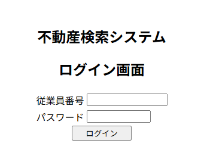
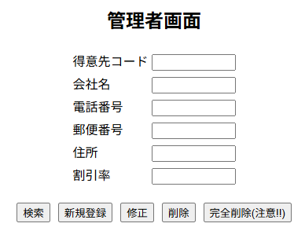
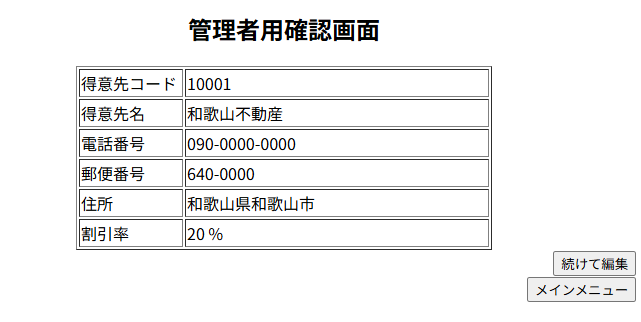

# Java-SalesSystem
Java学習課題として作成した販売管理システム。顧客・社員・受注を管理し、ログイン機能やDB接続を実装。

## 概要
顧客・社員・受注を管理する販売管理システムです。  
オンライン学習課題をベースに、JavaによるWebアプリケーション開発の基礎を実践しました。  

## 使用技術
- Java (JDK 17)
- Servlet / JSP
- JDBC (MySQL接続)
- MVCアーキテクチャ
- Eclipse (開発環境)

## 主な機能
- ログイン / ログアウト機能
- 顧客情報の検索・登録・更新
- 社員情報の管理
- 受注情報の管理
- 例外処理・バリデーション

## 画面イメージ

### ログイン画面

### 顧客登録フォーム

### 検索結果画面

## 学習で得られたこと
- DAO / DTO / Logic / Controller のレイヤ分割による設計
- DBアクセス処理の実装（Connection, PreparedStatement）
- エラーハンドリングと例外設計
- MVCアーキテクチャの理解

## ディレクトリ構成
src/main/java/jsys/sales/...

├── dao # DBアクセス層

├── entity # エンティティ

├── logic # ビジネスロジック

└── web # コントローラ（FrontControllerなど）

## 作者
濵仲 剛士  
（転職活動用ポートフォリオ / 学習課題成果物）
